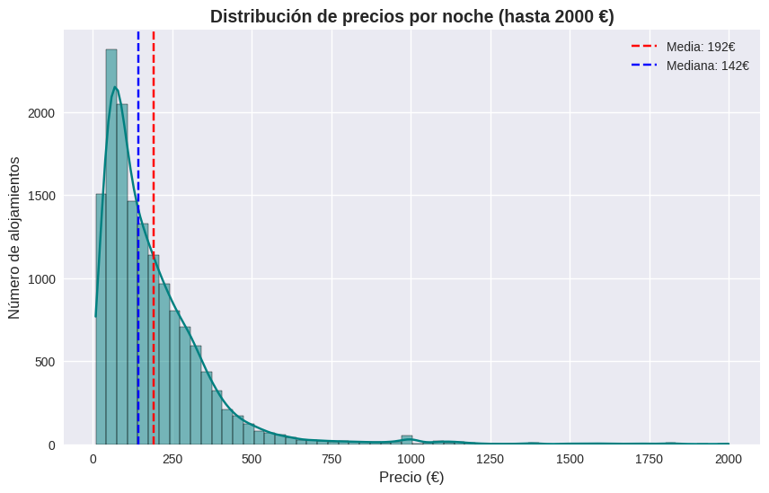
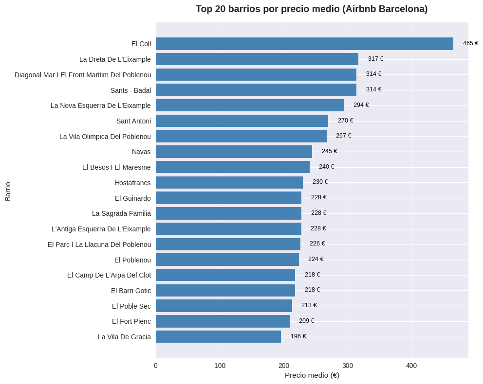
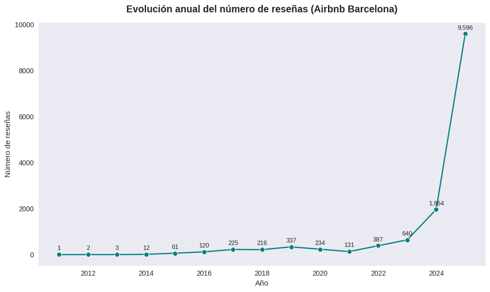

# 🏙️ Análisis Exploratorio de Airbnb en Barcelona

**Autor:** [Sorrow Grajales](https://github.com/SfromtheAbyss)  
**Fecha:** Octubre 2025  
**Tecnologías:** Python, Pandas, Seaborn, Folium, Plotly  

---

## 📌 Descripción del Proyecto

Este proyecto realiza un **Análisis Exploratorio de Datos (EDA)** sobre el conjunto de datos de alojamientos de **Airbnb en Barcelona**, con el objetivo de comprender los factores que influyen en los precios, la distribución geográfica de los anuncios y el comportamiento temporal de las reseñas.

El análisis forma parte de mi portafolio como **Data Scientist Junior**, demostrando habilidades en análisis de datos, visualización y comunicación de resultados.

---

## 🧱 Estructura del Proyecto
```
airbnb-eda/
│
├── data/ # Datasets originales (no subidos por tamaño)
│ └── listings.csv
│
├── notebooks/
│ └── airbnb_eda_barcelona.ipynb # Notebook principal con el análisis
│
├── src/
│ └── utils.py # Funciones de limpieza y soporte
│
├── reports/
│ └── figures/ # Gráficos y visualizaciones exportadas
│ ├── distribucion_precios.png
│ ├── top20_barrios.png
│ ├── heatmap_correlacion.png
│ └── mapa_airbnb_bcn.html
│
├── requirements.txt
├── README.md
└── .gitignore
```
---

## 🔍 Principales Insights

📊 **Distribución de precios:**  
La mayoría de alojamientos se concentran entre **50 € y 200 € por noche**, con valores atípicos en zonas premium como el Eixample o Sarrià.

📍 **Distribución geográfica:**  
Los barrios más activos son **Eixample, Ciutat Vella y Gràcia**, concentrando la mayoría de anuncios.

📈 **Tendencia temporal:**  
El número de reseñas creció de forma constante entre 2014 y 2019, mostrando el auge del turismo urbano en Barcelona, seguido de una ligera caída post-pandemia.

🧩 **Correlaciones:**  
Existe una correlación positiva entre **disponibilidad anual y número de reseñas**, mientras que el precio muestra baja correlación con las demás variables.

---

## 📊 Visualizaciones Destacadas

### 💸 Distribución de precios


### 🏘️ Top 20 barrios con más alojamientos


### 🔥 Mapa de correlaciones entre variables


### ⏱️​ Evolución anual por número de reseñas


### 🌍 Mapa interactivo de Airbnb Barcelona
👉 [Ver mapa interactivo](reports/figures/mapa_airbnb_bcn.html)

---

## ⚙️ Instalación y Uso

### 1️⃣ Clonar el repositorio
```
git clone git@github.com:TU_USUARIO/airbnb-barcelona-eda.git
cd airbnb-barcelona-eda
```
### 2️⃣ Crear entorno virtual
```
python -m venv venv
source venv/bin/activate  # En Windows: venv\Scripts\activate
```
### 3️⃣ Instalar dependencias
```
pip install -r requirements.txt
```
### 4️⃣ Ejecutar el análisis
```
jupyter notebook notebooks/airbnb_eda_barcelona.ipynb
```
---

## 🧠 Tecnologías y Librerías

Python 3.12

Pandas – Limpieza y manipulación de datos

NumPy – Cálculos numéricos

Matplotlib & Seaborn – Visualización estática

Plotly – Visualización interactiva

Folium – Mapas interactivos geoespaciales

Jupyter Notebook – Entorno de análisis reproducible

---

## 💡 Próximos pasos

Modelar precios con regresión lineal y XGBoost

Añadir análisis de sentimiento de reseñas (NLP)

Crear dashboard interactivo con Streamlit

---

## 👤 Autor

📌 Sorrow Grajales
📍 Barcelona, España
🔗 [LinkedIn](https://linkedin.com/in/sforsorrow)
💻 [GitHub](https://github.com/SfromtheAbyss)

---

### ✨ “Los datos cuentan historias. Nuestra labor es aprender a escucharlas.”
